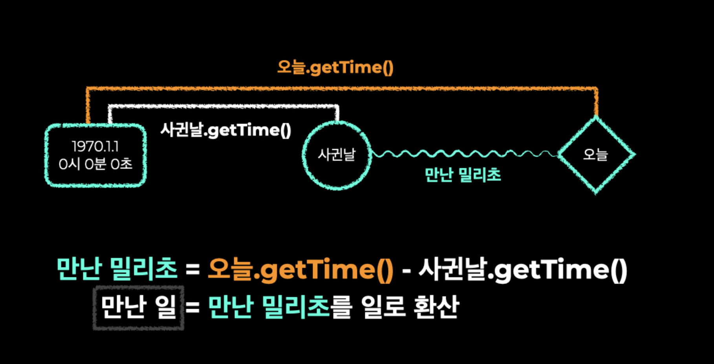
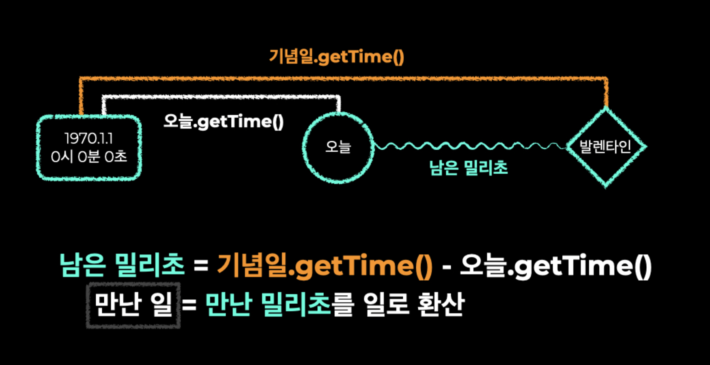
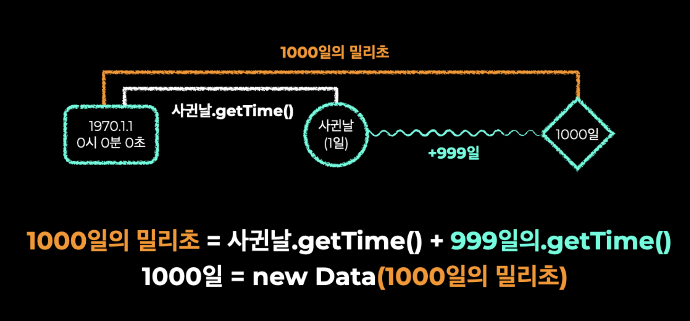

# new Date() 를 활용한 기념일 계산기 만들기


## 1. Date 객체 생성
```js
var now = new Date();
```
## 2. 연도를 가져오는 메서드 .getFullYear()
```js
console.log(now.getFullYear());
```
### 3. 월 정보를 가져오는 메서드 .getMonth() {0: 1월, 1: 2월, ... 10: 11월, 11: 12월}
```js
console.log(now.getMonth());
```
## 4. 일 정보를 가져오는 메서드 .getDate()
```js
console.log(now.getDate());
```
## 5. 1970년 1월 1일 00:00:00을 기준으로 흐른 시간을 밀리초로 표시하는 메서드 .getTime()
```js
console.log(now.getTime());
```
## 6. 특정 일의 Date 객체 생성
```js
var christmas = new Date('2020-12-25');
console.log(christmas);
```
## 7. 특정 함수의 Date 객체 생성
```js
// new Date 의 초기 계산 시점인 1970년 00시00분00초를 기준으로 1000ms 초 지났을때를 계산 
// Thu Jan 01 1970 09:00:01 GMT+0900 (Korean Standard Time)
var ms = new Date(1000);
console.log(ms);
```

### 만난 기념일 계산기


### 발렌타인데이 계산기


### 1000일 기념일 계산기


### Math.floor() 
소수점 제거

### (1000 * 60 * 60 * 24) + 1
날짜 계산법
1000ms * 60초 * 60분 * 24시간 + 하루(오늘부터 1일) 
```js
var day = Math.floor(timeDiff / (1000 * 60 * 60 * 24) + 1);
```

## 완성
