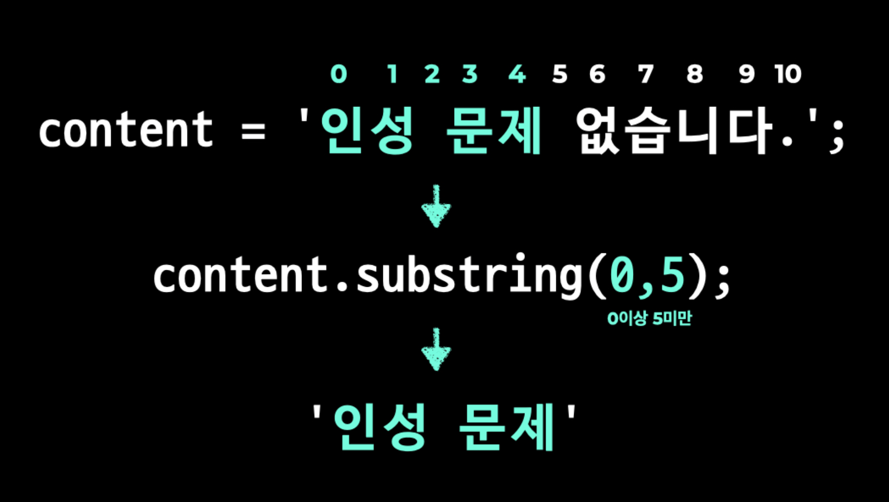

# substring 을 활용한 글자수 계산기

## substring()
문자열에서 특정 부분만 골라낼 때 사용하는 메서드입니다.

```js
// content 의 문자열을 0부터 199까지 잘라줘라 
//(슷자 카운팅은 0부터 시작)
content = content.substring(0,200);
```


## .value .innerHTML
결과값을 불러오거나 적용시킬때는 클래스.value 혹은 함수.innerHTML를 사용합니다. 

## function 함수이름(){}
여러번 재사용할 함수를 만들때는 function 함수이름(){} 로 원하는 코드를 {}안에 넣어서 사용합니다.
```js
function 함수이름(){
  원하는 코드
};
// 해당 함수이름()으로 사용하기
함수이름();
```